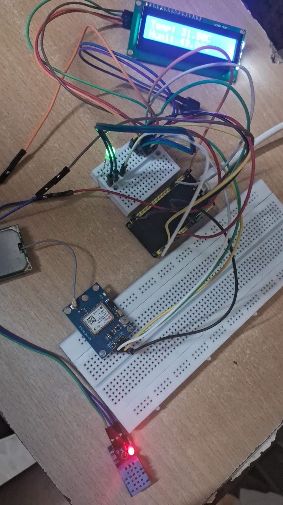
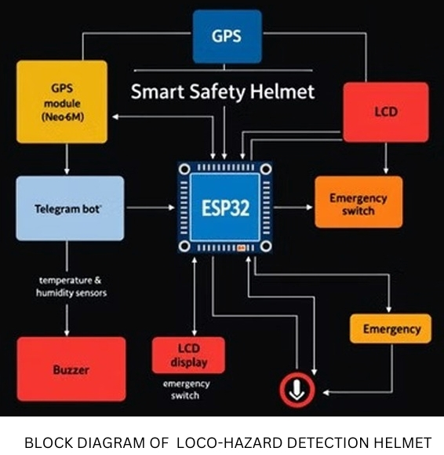

# 🪖 LOCO – Hazard Detection Helmet

A smart safety helmet built on the **ESP32** that monitors environmental conditions in hazardous workplaces (construction sites, mining zones, industrial areas) and sends real-time alerts and GPS location to emergency contacts via a **Telegram bot**.

Developed as a final-year B.E. (ECE) project at **Velammal Engineering College (Autonomous), Chennai**, under Anna University.

> Asfaq Farid S · Lokeshkumar K · Navin Karthik R
> Guided by Mrs. S. Kavitha | Dept. of ECE

---

## 📌 Overview


The LOCO-Hazard Detection Helmet goes beyond passive head protection. It continuously senses temperature and humidity, tracks the wearer's live GPS location, and triggers instant buzzer/LCD alerts on-site while also messaging pre-assigned emergency contacts through a Telegram bot named `LOCO_HAZARD_DETECTION`. The project also proposes a **Safety Patrol Service (SPS)** — a team of 7–10 personnel who monitor workers in real time and coordinate rapid intervention.

## ✨ Features

- 🌡️ **Real-time environmental monitoring** — temperature & humidity via DHT11
- 📍 **Live GPS tracking** — precise location using the NEO-6M module
- 🚨 **Instant hazard alerts** — buzzer + LCD notifications on the helmet
- 🤖 **Automated emergency messaging** — Telegram bot sends live coordinates to emergency contacts
- 🛑 **Manual emergency switch** — lets the wearer disable alerts/false alarms
- 👥 **Safety Patrol Service (SPS)** concept — human oversight layer for on-ground response

## 🧰 Hardware Used

| Component | Purpose |
|---|---|
| ESP32 | Main microcontroller |
| DHT11 | Temperature & humidity sensing |
| GPS NEO-6M | Location tracking |
| Buzzer | Audible hazard notification |
| LCD Display | On-helmet status display |
| LED | Visual notification |
| Push switch | Emergency/manual override |
| Breadboard & connecting wires | Prototyping |

## 💻 Software / Tools

- Arduino IDE (firmware development)
- Telegram Bot API (emergency messaging)

## 🔧 How It Works



1. The DHT11 sensor continuously feeds temperature/humidity data to the ESP32.
2. If readings cross the safe thresholds, the ESP32 triggers the buzzer and updates the LCD.
3. The NEO-6M GPS module supplies live coordinates.
4. On a hazard event, the system pushes an alert with the GPS location to the `LOCO_HAZARD_DETECTION` Telegram bot, which forwards it to emergency contacts / the SPS team.
5. A manual emergency switch lets the wearer silence false alarms or reset the system.

## 📂 Repository Structure

```
loco-hazard-detection-helmet/
├── firmware/
│   └── ESP32_DHT11_TEMPERATURE_AND_HUMIDITY.ino
├── docs/
│   └── LOCO_HAZARD_DETECTION_Project_Report.pdf
│   └── LOCO_HAZARD_DETECTION_HELMET.pptx
├── media/
│   ├── images/        # prototype photos
│   └── videos/        # demo videos (or links, see note below)
└── README.md
```

## 🏭 Applications

Construction sites · Mining · Manufacturing & heavy industries · Oil & gas · Power plants · Logistics & warehousing · Fire & emergency services

## 🚀 Future Scope

- Fatigue / heart-rate monitoring
- Toxic gas detection
- GSM-based alerts (no internet dependency)
- AI-driven predictive hazard analytics

## 📜 References

See [`docs/LOCO_HAZARD_DETECTION_Project_Report.pdf`](docs/LOCO_HAZARD_DETECTION_Project_Report.pdf) for the full literature survey and citations.


---
*Bachelor of Engineering — Electronics and Communication Engineering, Anna University, Even Sem 2024–25.*
